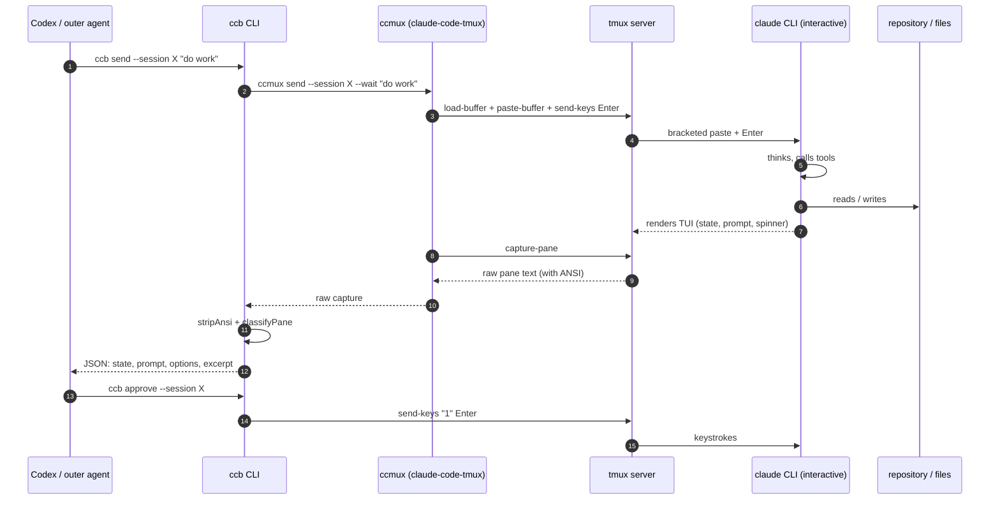
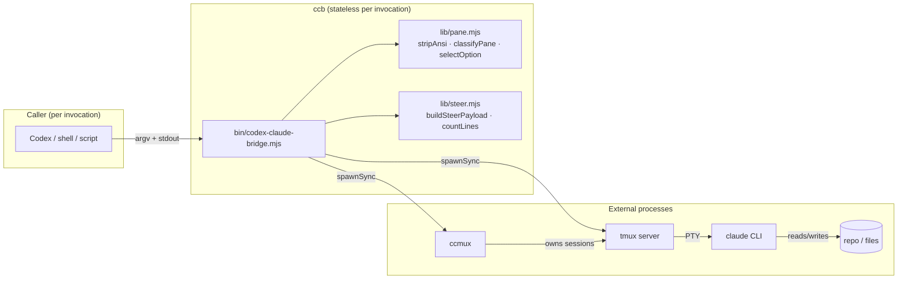

# Architecture

This document explains how `codex-claude-bridge` (the `ccb` CLI) actually works, what it does not try to do, and where the trust boundaries are. It is intended for developers who need to evaluate whether the bridge is safe to point at a real Claude Code session.

## Problem and non-goals

### Problem

Codex (or any other outer agent) wants to drive a real, interactive `claude` CLI session that runs in a terminal. The Claude Agent SDK and Anthropic API are different surfaces: they create a fresh programmatic conversation, not the interactive TUI that a human uses. If the goal is to share a long-lived Claude Code session across multiple Codex runs, observe its real pane output, and intervene the way a human would (typing, choosing menu options, interrupting, steering mid-turn), then the only honest mechanism is terminal automation.

`ccb` provides a small, dependency-free CLI that wraps [`claude-code-tmux`](https://www.npmjs.com/package/claude-code-tmux) (`ccmux`) and `tmux` to do exactly that.

### Non-goals

- `ccb` is **not** an Anthropic SDK client and never speaks to the Anthropic API directly.
- It does not bypass Claude Code's authentication, billing, model selection, safety policies, or any other Anthropic-controlled behavior. Authentication, subscription or usage billing, model choice, and policy decisions remain entirely controlled by Claude Code and your Anthropic account configuration.
- It is not a retry, queueing, or workflow engine. There is no dashboard, HTTP server, database, or worktree manager.
- It does not try to be portable to other AI CLIs. The classifier is wired specifically to Claude Code v2.x TUI output.
- It does not attempt to be fully robust to upstream TUI changes. Heuristics are conservative and prefer `unknown` over guessing.

## End-to-end mechanism

There are five layers:

1. **Codex / outer agent** invokes `ccb` as a normal subprocess. Every `ccb` invocation is short-lived and stateless from the caller's perspective.
2. **`ccb` CLI** is a dependency-free Node ESM package with one entry point (`bin/codex-claude-bridge.mjs`) and two pure helper modules (`lib/pane.mjs` for ANSI stripping and pane classification, `lib/steer.mjs` for the multiline steer payload builder). The entry script builds argv for `ccmux` or `tmux`, parses their output, and prints structured JSON or concise human output.
3. **`ccmux`** is the session manager from `claude-code-tmux`. It owns the mapping from a logical session name to a `tmux` session, plus job tracking and a completion protocol. `ccb` shells out to `ccmux` for `start`, `send`, `capture`, `status`, `jobs`, `attach`, `kill`, and `steer` (legacy path).
4. **`tmux`** is the terminal multiplexer hosting the actual `claude` process. `ccb` talks to it directly for low-level keystrokes (`key`, `choose`, `enter`, `escape`, `interrupt`), for typed text via `paste-buffer` (`type`, `slash`), and for the multiline-safe `steer` path.
5. **`claude` CLI** is the real interactive Claude Code TUI. It reads from and writes to the pseudo-terminal attached by `tmux`, exactly as it would for a human.

### Component view

The bridge itself owns no long-running state. Persistence lives in three places: the `tmux` server (the live process and PTY context for each session), `ccmux`'s state registry at `~/.pi/ccmux/state.json` (or `$CCMUX_HOME` if set; session names, job records, log paths), and per-job completion markers under `<session-cwd>/.ccmux/jobs/`. Claude Code may persist its own transcripts separately; the bridge has no integration with any Claude resume or recovery mechanism.

## Session naming and persistence

A logical `--session NAME` is the only handle the caller needs. `ccb` resolves it through two layers:

- `safeName(NAME)` normalizes the user-supplied name: letters (case preserved), digits, underscore, dot, and dash are kept; any other run of characters becomes a single `-`; leading and trailing dashes are stripped; the result is truncated to 60 characters. The result is used both as the `ccmux` session name and, with a `ccmux-` prefix, as the `tmux` session name.
- `ccmux` keeps the canonical mapping (working directory, start command, log path, model, alive flag, last job id) in `~/.pi/ccmux/state.json` (or `$CCMUX_HOME` if set). Reusing a name from another Codex chat or another terminal reattaches to the same `tmux` session as long as it is alive.

**Persistence boundaries**:

- `ccb` invocations are stateless. Two `ccb` calls in the same Codex chat do not share memory; they share state only through the underlying `tmux` session.
- If the `tmux` server dies, all `claude` sessions inside it die. `ccb` cannot resurrect the conversation; recovery means starting a new session and accepting that the in-context conversation is lost. `claude --resume` is outside the bridge's scope.
- If `claude` crashes inside a live `tmux` session, the `tmux` window remains open and the shell prompt reappears. `inspect` may classify this as `crashed` or `unknown` depending on what is on screen.

### Structured vs. raw control

| Command  | What it does                                                                                                                                                                                                                                                                                                                                                              | Use when                                                                                                                              |
| -------- | ------------------------------------------------------------------------------------------------------------------------------------------------------------------------------------------------------------------------------------------------------------------------------------------------------------------------------------------------------------------------- | ------------------------------------------------------------------------------------------------------------------------------------- |
| `send`   | Wraps `ccmux send --wait`. Sends a prompt, waits for the ccmux completion marker, returns ccmux's job JSON. Uses the ccmux completion protocol so the caller knows when the turn finished.                                                                                                                                                                                | Codex wants a request/response cycle with a clear "done" signal.                                                                      |
| `type`   | Loads arbitrary text into a tmux buffer and pastes it (no `-r`; tmux converts LF to CR). Presses Enter unless `--enter` is omitted.                                                                                                                                                                                                                                       | Inject a single-line message as if typed. Use for `/slash` commands or messages without newlines.                                     |
| `slash`  | Same as `type` but prepends `/` if missing and always presses Enter.                                                                                                                                                                                                                                                                                                     | Invoke a Claude Code slash command (`/cost`, `/release-notes`, etc.).                                                                 |
| `steer`  | Multiline-safe: writes the message to a temp file, loads it into a named tmux buffer, and pastes with `paste-buffer -dpr` (bracket paste + LF preservation). Sends Enter. Prefixed with `Steering update from ccmux:` so the live session can recognize injected steering.                                                                                              | Inject a long, potentially multiline message mid-turn. The only path that reliably preserves newlines end-to-end.                     |
| `key`    | Sends raw tmux key names (`Up`, `Down`, `Enter`, `C-c`, `Tab`, etc.) via `tmux send-keys`.                                                                                                                                                                                                                                                                                | Escape hatch for any keystroke not covered by a higher-level command.                                                                 |
| `choose` | Sends `<number>` + `Enter`.                                                                                                                                                                                                                                                                                                                                               | Pick a numbered menu option by position. Use when `approve`/`deny` refuse or when you already know the option number from `inspect`. |

`send` is the only command that blocks until ccmux reports a job complete. Everything else is fire-and-forget; the caller is expected to follow up with `inspect` or `watch`.

## Multiline steer implementation

`steer` is the only path that needs to preserve embedded newlines, because Codex steering messages often span multiple paragraphs. The naive approaches all fail:

- `tmux send-keys -l "line1\nline2"` with newlines converted to `\r` submits each line as a separate prompt, losing everything after the first line.
- `tmux paste-buffer -p` (bracket paste) without `-r` lets tmux replace each LF with CR before wrapping it in the bracket sequence. A TUI that interprets CR as Enter will still split the paste.
- Calling `ccmux steer` with a multiline argv on Windows can mangle embedded newlines depending on the shell that `spawnSync` selects.

`steerMessage(session, message)` does this instead:

1. Builds the payload with the pure `buildSteerPayload(message)` helper (`Steering update from ccmux:\n` + trimmed message).
2. Writes it verbatim to a per-invocation temp file under `os.tmpdir()/codex-claude-bridge/`.
3. Loads the file into a named tmux buffer with `tmux load-buffer -b <buffer> <msys-path>`.
4. Pastes with `tmux paste-buffer -dpr -b <buffer> -t <session>`:
   - `-d` deletes the buffer after paste,
   - `-p` wraps the paste in bracketed-paste markers so Claude Code's TUI treats it as a paste rather than typed input,
   - `-r` disables tmux's LF→CR conversion so embedded newlines survive into the TUI verbatim.
5. Sends a single `Enter` to submit the pasted block.
6. Cleans up the temp file and best-effort deletes the tmux buffer in a `finally` block.

The payload is built by a pure function in `lib/steer.mjs` so unit tests can verify newline preservation without invoking tmux.

## Pane capture, ANSI cleanup, and state classifier

### Capture

`captureSession(session, lines)` calls `ccmux capture --session NAME --lines N`, which in turn runs `tmux capture-pane -p -J -S -N -t <session>` (print to stdout, join wrapped lines, capture N lines above the cursor). The result is tmux's text rendering of the pane; whether it contains ANSI escape sequences depends on tmux configuration and terminal state. `stripAnsi` (below) is defensive against escape and control noise regardless of what tmux returns.

### ANSI and control cleanup

`stripAnsi(text)` in `lib/pane.mjs` removes, in order:

1. OSC sequences (`ESC ] ... BEL` and `ESC ] ... ESC \`) used for window title and clipboard operations.
2. CSI sequences (`ESC [ ... letter`) used for colors, cursor movement, and most rendering.
3. Two-character ESC sequences (`ESC @` through `ESC _`).
4. C0 control characters except `\t` (tab) and `\n` (newline), plus DEL (0x7F).

`cleanLines(text)` then splits on newlines and trims trailing whitespace per line. The trailing-whitespace trim matters because Claude Code pads the right edge of the pane to draw its borders, and the input prompt line is usually `>` followed by a long run of spaces.

`excerpt(text, maxLines)` returns the last `maxLines` non-empty cleaned lines, joined by newlines. This is the human-readable excerpt attached to every `inspect` and `watch` event.

### Classifier precedence and evidence model

`classifyPane(rawText, opts)` runs the following ordered checks. The first match wins, and every check adds fields to `result.evidence` so callers can see why a classification was reached.

| Order | State              | Required signal                                                                                                                                            | Notes                                                                                                                                                                                                                                            |
| ----- | ------------------ | ---------------------------------------------------------------------------------------------------------------------------------------------------------- | ------------------------------------------------------------------------------------------------------------------------------------------------------------------------------------------------------------------------------------------------ |
| 1     | `done`             | `CCMUX_DONE:<uuid>` within the last 8 cleaned lines. Tolerates optional whitespace after the colon.                                                        | Only the last 8 lines count so an old completion marker from an earlier turn does not pin the session to `done` forever. The most recent match wins.                                                                                              |
| 2     | `permission_prompt` or `needs_input` | An option cluster (≥2 options) within the last 30 lines, **at least one of which carries a selection cursor** (`❯`/`›`/`»`), plus an optional question line above it. `permission_prompt` requires permission wording in the question. | The cursor requirement is what distinguishes a live menu from numbered prose (e.g. items rendered by the assistant from a steering message). Without it, any numbered list near the pane bottom would be misextracted as a menu. Runs before the spinner check so a fresh menu outranks a stale spinner still visible in the 40-line scan window. |
| 3     | `permission_prompt` or `needs_input` | Inline `y/n` prompt (`? Question? (y/n)` or `[y/n]`) within the last 12 lines.                                                          | Restricted to the very bottom to avoid matching `y/n` patterns in scrollback.                                                                                                                                                                     |
| 4     | `thinking`         | Active spinner line within the last 40 lines. Glyph-agnostic: matches `<non-alphanumeric> <CapitalizedLabel>… (<detail> tokens)`.                          | Runs after the prompt checks so an older spinner cannot mask a fresh menu.                                                                                                                                                                       |
| 5     | `idle`             | Claude footer (`bypass permissions`, `shift+tab to cycle`, or `shift+tab`) in the last 6 lines **and** an empty `>` prompt (either on its own line or trailing a `──` divider) in the last 10 lines. |                                                                                                                                                                                                                                                  |
| 6     | `crashed`          | Positive crash signal (`panic:`, `fatal error`, `assertion failed`, `segmentation fault`, `core dumped`, `claude: command not found`, `process exited`, `stack trace:`) in the last 30 lines **and** no live UI signal (footer + empty prompt, or an active spinner). | Hook errors such as `chrome-devtools-axi.js: command not found` from `SessionStart` hooks appear in healthy sessions; the "no live UI supersedes" guard prevents those from flipping a healthy session to `crashed`.                              |
| 7     | `unknown`          | Fallthrough.                                                                                                                                               | The bridge prefers `unknown` over guessing. Codex should treat `unknown` as "do not act; capture and ask a human, or wait."                                                                                                                      |

Every classification result includes `evidence`: a small object with the fields that drove the decision (`doneMarker`, `spinner`, `footer`, `emptyPrompt`, `optionCount`, `questionLine`, `selectionCursor`, `optionsWithoutCursor`, `crashSignalPresent`, and so on). When numbered items are seen near the bottom but no cursor is present, `optionsWithoutCursor` records the count and the classifier falls through to a non-prompt state. The `inspect --json` payload is stable and round-trippable.

## Permission prompt parsing and guarded menu handling

`ccb approve` and `ccb deny` call `resolvePromptAction`, which captures the pane, classifies, and refuses unless the state is `permission_prompt` or `needs_input`.

- **Inline `y/n`** (no options extracted): send `y` or `n` + `Enter`.
- **Numbered menu**: `selectOption(options, intent)` looks for the option whose label has the strongest keyword overlap with the YES or NO set (`yes`, `allow`, `proceed`, `continue`, `accept`, `approve`, `confirm`, `ok`, `always`, `trust`, `install`, `run` for `approve`; `no`, `deny`, `cancel`, `reject`, `stop`, `abort`, `skip`, `decline`, `never` for `deny`). Anti-overlap must not exceed positive overlap. The pick is returned with `via: "label-match"`. If no label matches, `selectOption` returns `null` and the command refuses with exit code 3. There is **no positional fallback** — the bridge never blindly sends `"1"`.
- **Unnumbered cursor menu**: `selectOption` returns the same label-matched target plus navigation info (`targetIndex`, `selectedIndex`, `selectionState`, `moves: { direction, count }`). `resolvePromptAction` will:
  - Refuse (exit 3) if no option is selected (`selectionState: "none"`) — there is no cursor to navigate from.
  - Refuse (exit 3) if more than one option is selected (`selectionState: "ambiguous"`).
  - Otherwise emit `Up`/`Down` keystrokes to move from the current cursor to the target, then `Enter`.
- **Top-level refusal**: when the state is not `permission_prompt` or `needs_input`, the command exits 2 and prints a JSON payload with `error: "no prompt"`, the detected `state`, and a hint.

`ccb choose N` is a deliberate escape hatch: it sends `<N>` + `Enter` verbatim, with no classification. Use it when `approve`/`deny` refuse and the caller knows the option position from a prior `inspect`.

## Windows / MSYS2 patch mechanism

`ccmux` is a generic cross-platform tool. On Windows it shells out to MSYS2 `tmux` via PowerShell, but the upstream code does not fully normalize paths or quote them for that environment. `ccb patch-ccmux-windows` rewrites the installed `claude-code-tmux/src/core.mjs` file in place. The changes fall into six areas:

1. **Helpers.** Adds a Windows-aware `shellQuote` (escapes `\` and `"` for PowerShell argv) and an `msysPathForShell` helper that converts Windows paths (`C:\foo\bar`) to MSYS2 POSIX form (`/c/foo/bar`) so `tmux` receives paths it understands.
2. **`pipe-pane` log path.** Routes `logPath` through `msysPathForShell` so `tmux pipe-pane` writes to the intended file.
3. **`send-job` load-buffer.** Routes `job.promptPath` through `msysPathForShell` so `tmux load-buffer` finds the prompt file that `ccb send` relies on.
4. **Legacy upstream `steerSession` load-buffer.** Routes the per-call `promptPath` through `msysPathForShell`. Leaves a `// ccb-patched` marker so re-runs are no-ops.
5. **Windows paste visibility.** After `tmux paste-buffer -p -r`, inserts a `process.platform === "win32"` break in the paste-visibility retry loop so ccmux does not wait for the prompt text to become visible in the pane (which is unreliable on Windows).
6. **PowerShell Claude launch.** Rewrites the command-composition step to prepend `Set-Location -LiteralPath <cwd>` on Windows so `--cwd` is honored, and strips conflicting `ANTHROPIC_*` environment variables from the spawn environment before invoking `claude`.

Important: the bridge's own `ccb steer` command does **not** use ccmux's `steerSession`. It talks to `tmux` directly via a per-invocation temp file and `tmux load-buffer` / `paste-buffer -dpr`. Item 4 patches a legacy ccmux code path that the bridge no longer exercises end-to-end. The regression test still verifies that the search/replace patterns continue to match upstream source (so the patcher does not silently break on a future ccmux release), but a missing patch does **not** truncate `ccb steer` output.

The patcher is idempotent: running it twice does not duplicate edits, and the regression test `regression: Windows steer load-buffer patch present in bridge source` verifies that the search/replace patterns still match the upstream source.

### Upgrade behavior

When you reinstall or upgrade `claude-code-tmux`, npm overwrites the patched file. You must re-run `ccb patch-ccmux-windows` after every `ccmux` upgrade. The bridge detects whether the patch is already present and reports `changed: false` when no work is needed, so re-running is always safe. `doctor` does not currently warn when the patch is missing — a future improvement (see [RELIABILITY.md](./RELIABILITY.md)).
