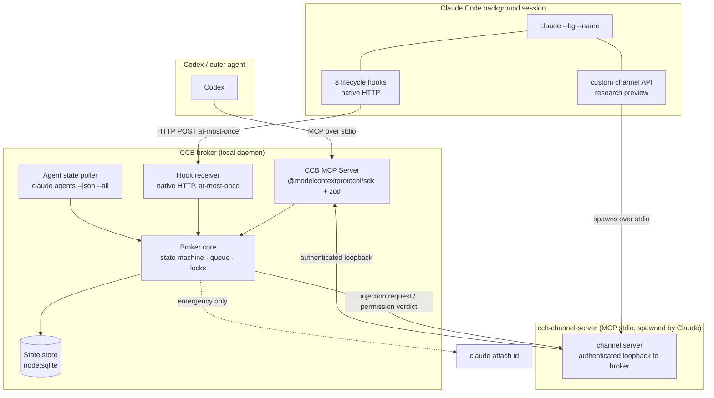
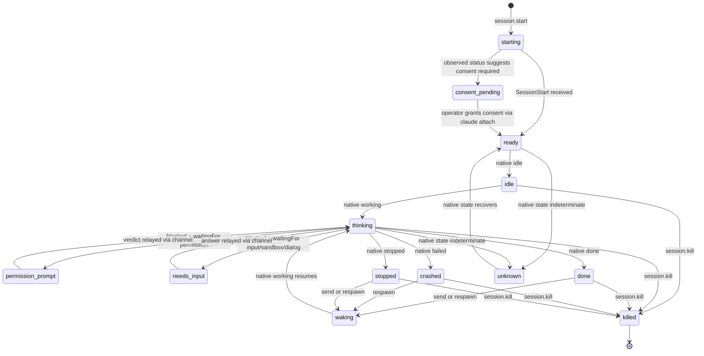

# Native Control Plane (V2) — Technical Design Spec

**Status:** Draft for approval, revision 2 after factual audit. Design only; no implementation in this document.
**Date:** 2026-07-23
**Audience:** Maintainers of `codex-claude-bridge` and reviewers who need to decide whether V2 is safe to build.

## Context and motivation

V1 of `codex-claude-bridge` (`ccb`) drives an interactive `claude` CLI by wrapping `ccmux` and `tmux`, capturing pane text, stripping ANSI, and matching conservative regex signals to classify pane state. This works for careful, supervised automation of V1-style sessions but has structural limitations no amount of regex tuning can fix:

- State is inferred from rendered text, so it is only as current as the last capture and only as accurate as the TUI signature allows.
- Permission prompts and menu options are recognized by wording and layout, not by a structured signal from Claude Code itself.
- Mid-turn steering goes through `tmux paste-buffer`, which works for V1 sessions but cannot distinguish "inject a steering update" from "submit a new prompt" at the protocol level.
- There is no event stream. Codex polls `inspect` or `watch`; it cannot subscribe to lifecycle events.

V2 keeps Claude Code as a hard dependency and replaces terminal scraping with a native, event-driven control plane built on Claude Code surfaces that V1 did not use:

1. **`claude agents --json --all` as the canonical lifecycle authority.** Native agent state (`working`, `blocked`, `done`, `failed`, `stopped`) maps directly to broker state. The broker polls this as the source of truth.
2. **Native HTTP hooks** that emit structured lifecycle events (`SessionStart`, `UserPromptSubmit`, `PreToolUse`, `PostToolUse`, `PermissionRequest`, `Stop`, `StopFailure`, `SessionEnd`). Hooks enrich the native state but never override a contradictory native signal.
3. **A custom development channel** (research preview) exposed through `ccb-channel-server`, an MCP server spawned by Claude over stdio. The broker asks it to emit `notifications/claude/channel` for message injection and relays permission verdicts back through `notifications/claude/channel/permission`.

V2 does **not** claim zero TUI use. One-time channel consent (behavior unverified — see [R0 spike](#rollout-phases)), emergency mid-turn interventions, and `unknown`-state debugging may still require attaching to the live session via the native `claude attach <id>` command. The V1 `ccmux`/`tmux` transport is retained for V1 sessions and old Claude versions only; it is not a V2 dependency.

## Design summary



Five components, one primary transport, one emergency path:

- **Primary transport:** Codex → broker MCP server → broker core → ccb-channel-server (over authenticated loopback) → Claude custom channel. Lifecycle events flow back via native HTTP hooks → hook receiver → broker core. Agent state authority flows from `claude agents --json --all` → agent state poller → broker core.
- **Emergency path:** `claude attach <id>` (native). Used for one-time channel consent if the R0 spike confirms it is required, for mid-turn interventions the channel cannot express, and for debugging. An optional experimental native-attach PTY/tmux adapter may wrap `claude attach <id>` for exact keystroke automation; this is not the V1 ccmux stack and is not a hard dependency.

## Components

### 1. Codex-facing MCP server (`ccb-mcp-server`)

Implemented with the official `@modelcontextprotocol/sdk` and `zod` for schema validation. Exposes a small set of tools (see [Codex MCP tool schemas](#codex-mcp-tool-schemas-conceptual)), one resource type (session state), and no prompts in v2.0. The server speaks MCP over stdio when launched by Codex. The SDK handles framing, capability negotiation, and JSON-RPC dispatch; `zod` validates every tool argument and every hook payload after receipt. No hand-rolled MCP framing.

### 2. Broker core (`ccb-broker`)

A long-lived local process that owns:

- **Session registry** — logical name → broker session record (see [Session identity mapping](#session-identity-mapping)).
- **Event log** — append-only, per-session, ordered by monotonic sequence number assigned by the broker after receipt.
- **State machine** — per-session lifecycle, derived from native agent state with hook enrichment (see [State machine and precedence](#state-machine-and-precedence)).
- **Mutation queue** — per-session, one mutation in flight at a time (see [Queue, locking, idempotency](#queue-locking-idempotency)).
- **Subscriptions** — `watch` streams multiplexed to connected MCP clients.

The broker is single-process and single-threaded for mutation handling. Reads (inspect, watch) are concurrent and lock-free against the state store. The implementation is Node.js with no platform-specific native modules.

### 3. Hook receiver (`ccb-hook-receiver`)

Receives lifecycle events from native Claude Code HTTP hooks. A hook is configured with a `url`, optional `headers`, and optional `allowedEnvVars`. Claude delivers the hook payload as an HTTP POST. Delivery is nonblocking and at-most-once: if the broker is unreachable or returns an error, the event is not retried and does not spill to disk. The broker assigns `event_id` and `seq` after receipt and stores both the raw hook input and the normalized payload.

An optional file-queue fallback uses native command hooks (a shell command that writes JSON to a file) for environments where HTTP delivery is not available. The same at-most-once contract applies.

The receiver validates the normalized payload with `zod` against the documented hook schema (see [Event schema](#event-schema)). Invalid payloads are retained as rejected raw events with their validation error, but they do not enter the normalized lifecycle stream. It does not retry.

### 4. ccb-channel-server

An MCP server spawned by Claude over stdio when the custom development channel is active. It is not launched by the broker. Its responsibilities:

- **Maintain an authenticated loopback connection to the broker.** This connection's presence is the broker's liveness signal for the session (see [Restart and wake behavior](#restart-and-wake-behavior)).
- **Emit `notifications/claude/channel` on broker request.** The broker asks the channel server to inject a message; the channel server emits the notification into the Claude session.
- **Forward replies via its reply tool.** A reply from inside the Claude session is forwarded back to the broker over the loopback connection.
- **Receive `notifications/claude/channel/permission_request`, forward to the broker, then emit the verdict via `notifications/claude/channel/permission`** with `request_id` and `allow`/`deny`. This is the permission relay path. PermissionRequest hooks fire independently for observability but do **not** drive the relay.

The channel server is isolated behind an interface so that if the custom-channel surface changes or is removed in a future Claude release, the broker can continue operating in a hooks-and-poll-only mode (reduced capability: no injection, no permission relay through the channel).

### 5. Claude background session

A `claude` process started via `claude --bg --name <name>` with:

- The 8 lifecycle hooks configured to emit events to the broker's hook receiver.
- The custom development channel registered so that Claude spawns `ccb-channel-server` over stdio.
- A conversation state that survives across `claude respawn <id>` (conversation intact) and across `claude --bg` restarts (native roster persistence).

The native supervisor handles unexpected exits. The broker does not compete with it: the broker does not auto-restart crashed sessions unless the operator opts in, and when it does, it calls `claude respawn <id>` rather than starting fresh.

### 6. Emergency attach (native)

`claude attach <id>` opens the live session for manual interaction. This is the V2 emergency path. It is native and does not require ccmux or tmux.

For exact keystroke automation against an attached session, an optional experimental native-attach adapter may wrap `claude attach <id>` in a PTY/tmux layer. This adapter is distinct from the V1 ccmux stack (which only supports V1 sessions and old Claude versions) and is not a hard V2 dependency. It is documented as experimental and must be selected explicitly.

## Session identity mapping

V2 preserves the V1 `safeName` rules so existing operator muscle memory and session names carry over: letters (case preserved), digits, `_`, `.`, `-` are kept; other runs collapse to a single `-`; leading and trailing dashes are stripped; result truncated to 60 characters.

The broker maps each logical name to a session record:

```typescript
type SessionRecord = {
  logical_name: string;            // safeName(user-supplied name)
  broker_session_id: string;       // UUID, assigned by broker
  claude_agent_id: string | null;  // native agent id from claude agents
  claude_session_id: string | null;// native session id, populated on SessionStart
  cwd: string;
  model: string | null;
  effort: string | null;
  permission_mode: "default" | "acceptEdits" | "auto" | "dontAsk" | "plan" | "bypassPermissions";
  created_at: string;              // ISO 8601
  last_event_at: string;           // ISO 8601
  state: SessionState;
  channel_connected: boolean;      // loopback connection presence
  transport: "channel" | "native-attach" | "legacy";
};
```

The registry persists in the SQLite store. On broker restart, the registry is reloaded and each record is reconciled against `claude agents --json --all` (see [Restart and wake behavior](#restart-and-wake-behavior)). Multiple Codex chats reattach to the same logical name and hit the same session record. The broker is the single source of truth; Codex chats do not hold session state.

## Broker API

The broker exposes two interfaces and polls one external source.

### A. Codex-facing MCP server

Stdio (when launched by Codex). Tools listed in [Codex MCP tool schemas](#codex-mcp-tool-schemas-conceptual). Resources: `session://<name>/state`, `session://<name>/events?limit=N`. The server authenticates the caller by PID-inheritance trust (Codex launched the broker).

### B. Hook receiver

`POST http://127.0.0.1:<port>/hooks/<event_type>` with a native hook payload. The receiver validates with `zod`, assigns `event_id` and `seq`, stores raw input plus normalized payload, and enqueues. Returns `202 Accepted` immediately. Delivery is at-most-once; no retry, no spill. The optional file-queue fallback uses command hooks and follows the same contract.

### C. Agent state poller

The broker polls `claude agents --json --all` at a configurable interval (default 1000 ms) and treats the returned native state as the authority for each session's lifecycle. Hook events enrich this state (e.g., supplying `tool_input` context, `last_assistant_message` excerpts) but never override a contradictory native signal. If the poller reports `working` and the most recent hook was `Stop`, the session is `thinking`, not `done`.

### Internal state store

Canonical store: `node:sqlite` (Node's built-in SQLite module, stable in Node >= 22.13). V2 requires Node >= 22.13. The store holds the session registry, the event log, and the mutation idempotency cache in a single database file at `$CCB_HOME/state.db`.

An optional append-only raw event export writes every received hook payload (raw input as delivered) to `$CCB_HOME/events-raw/<session_id>/<seq>.json` for audit and debugging. This export is opt-in and does not replace the SQLite store.

`$CCB_HOME` defaults to `~/.pi/ccb-broker/` (mirroring ccmux's `~/.pi/ccmux/` layout) or `$CCB_HOME` if set. Directory mode `0700`; sensitive files mode `0600`.

## Event schema

### Hook payload (raw input, as delivered by native hooks)

Every native hook delivers a common envelope plus event-specific fields. The broker stores this raw input verbatim alongside the normalized payload.

**Common fields (all hook events):**

| Field              | Type   | Notes                                              |
| ------------------ | ------ | -------------------------------------------------- |
| `session_id`       | string | Native Claude session id                           |
| `transcript_path`  | string | Path to the session transcript                     |
| `cwd`              | string | Working directory                                  |
| `permission_mode`  | string | Current permission mode                            |
| `hook_event_name`  | string | Matches the event type                             |

**Event-specific fields:**

| Event type           | Additional fields                                                                                           |
| -------------------- | ---------------------------------------------------------------------------------------------------------- |
| `SessionStart`       | _(common fields only)_                                                                                      |
| `UserPromptSubmit`   | _(common fields; the submitted prompt text is available via `transcript_path`)_                             |
| `PreToolUse`         | `tool_name`, `tool_input`                                                                                   |
| `PostToolUse`        | `tool_name`, `tool_input`, `tool_response`                                                                  |
| `PermissionRequest`  | `tool_name`, `tool_input`, `permission_suggestions?` (optional; no relay `request_id` in the hook payload)  |
| `Stop`               | `stop_hook_active`, `last_assistant_message`, `background_tasks`, `session_crons`                          |
| `StopFailure`        | `error`, `error_details?`, `last_assistant_message?`                                                        |
| `SessionEnd`         | `reason`: one of `clear`, `resume`, `logout`, `prompt_input_exit`, `bypass_permissions_disabled`, `other`  |

The `PermissionRequest` hook fires for observability and logging. It does **not** carry a relay `request_id` and does **not** drive the permission relay; the relay path runs through the ccb-channel-server's `notifications/claude/channel/permission_request` → broker → `notifications/claude/channel/permission` flow (see [ccb-channel-server](#4-ccb-channel-server)).

`Stop` does not carry a structured `reason` field; the broker does not invent one. `SessionEnd` `reason` is an enum fixed by the native hook contract; the broker does not remap `crash` onto it. `PostToolUse` does not carry a duration; the broker does not synthesize one. `UserPromptSubmit` does not carry `prompt_id` or `source`; the broker does not invent them.

### Normalized event envelope (broker-assigned, stored in SQLite)

```typescript
type EventEnvelope = {
  event_id: string;         // UUID, assigned by broker on receipt
  session_id: string;       // broker session id
  event_type: EventType;
  timestamp: string;        // ISO 8601, assigned by broker on receipt
  seq: number;              // monotonic per session, assigned by broker
  raw: object;              // verbatim hook input
  normalized: object;       // zod-validated, schema-stable projection
};
```

The normalized envelope is the public contract for `session.watch` and `session.events`. Field names and types are stable across patch releases. The raw field preserves the original hook payload for audit.

## State machine and precedence

Per-session lifecycle. The authority is `claude agents --json --all`. States:

`starting`, `consent_pending`, `ready`, `idle`, `thinking`, `permission_prompt`, `needs_input`, `done`, `crashed`, `stopped`, `waking`, `killed`, `unknown`.

Native state → broker state mapping:

| Native agent state                                 | Broker state          |
| -------------------------------------------------- | --------------------- |
| `working`                                          | `thinking`            |
| `blocked` + `waitingFor` indicates permission prompt | `permission_prompt`  |
| `blocked` + `waitingFor` indicates input needed / sandbox / dialog | `needs_input` |
| `done`                                             | `done` (resumable)    |
| `failed`                                           | `crashed` (resumable) |
| `stopped`                                          | `stopped` (resumable) |

`done`, `crashed`, and `stopped` are **resumable**, not terminal. A `send` or `claude respawn` against a session in any of these states transitions through `waking` back to `thinking`.



Precedence (highest first), applied when the poller and hooks disagree within one reconciliation tick:

1. `killed` — operator action. The only true terminal state.
2. Native agent state from `claude agents --json --all` — the authority.
3. Hook enrichment — adds context (`tool_input`, `last_assistant_message`, etc.) but does not override native state.
4. `unknown` — native state indeterminate or poller unreachable.

`Stop` indicates the end of a response, but background tasks (`background_tasks`, `session_crons` in the `Stop` payload) may wake the session afterward. The native agent state remains the authority: if background work resumes, the poller reports `working` and the broker transitions back to `thinking`.

## Queue, locking, idempotency

### Per-session mutation queue

Each session has a FIFO mutation queue. Mutations are: `send`, `steer`, `approve`, `deny`, `choose`, `interrupt`, `kill`, `respawn`. Only one mutation runs at a time per session; the next dequeues when the previous is acknowledged (by a native state change observed by the poller, or by the channel server confirming delivery). Reads (`inspect`, `events`, `watch`) do not enqueue.

### Broker singleton lock

One broker per user account per machine (the lock lives under the per-user `$CCB_HOME`). PID-file lock at `$CCB_HOME/broker.lock`, checked on startup. If the PID is live, the new broker exits with an error. If the PID is stale (process gone), the new broker takes the lock and runs reconciliation.

### Idempotency

Every mutation request carries a client-supplied `idempotency_key` (UUID). The broker caches `idempotency_key → response` for 5 minutes. A duplicate key returns the cached response without re-executing the mutation. The cache lives in the SQLite store and survives broker restart within the 5-minute window. Broker event IDs identify receipts; the broker does not content-deduplicate separate hook calls because two legitimate events can have identical payloads.

### Queue back-pressure

The per-session event log in SQLite is unbounded (disk is the limit). The in-memory subscription buffer for `watch` streams is bounded (default 256 events per subscriber); a slow consumer receives a `dropped_events` notification and continues from the current tail. Mutation requests are never dropped; if the mutation queue is full (default 16 pending), new requests receive a structured `queue_full` error and must retry.

## Restart and wake behavior

### Liveness

Liveness for a session is the presence of the authenticated loopback connection from its `ccb-channel-server` to the broker. No heartbeat protocol is used. When the channel server connects, the session is live; when it disconnects, the session is presumed dead or channel-less until the next agent-state poll clarifies.

### Broker restart

Broker state is durable in SQLite. On restart:

1. Acquire PID-file lock (or fail if another broker is live).
2. Reload session registry and event log from SQLite.
3. Poll `claude agents --json --all` and reconcile each session record against native agent state.
4. Sessions whose native agent is alive transition to the native-mapped state.
5. Sessions whose native agent is absent transition to `crashed` (resumable) or `unknown` (if the poller cannot tell).
6. Sessions previously `thinking` that the poller now reports as `done` transition to `done`; the broker does not assume the turn was lost.

### Claude session restart and respawn

If a Claude background session exits unexpectedly, the native supervisor handles it. The broker does not compete. When the operator explicitly requests recovery, the broker calls `claude respawn <id>`, which is documented to preserve the conversation. The broker does not start a fresh session and does not claim the prior history is lost.

### Machine reboot / wake

The broker is installed as a user service (`ccb broker install` generates the appropriate unit: systemd user unit on Linux, launchd agent on macOS, Windows Service or per-user autostart on Windows). On wake:

1. Service manager starts the broker.
2. Broker runs the restart reconciliation above.
3. Native roster persistence identifies resumable agents. The broker reports stopped or failed agents and waits for an explicit `respawn`; automatic recovery remains Claude supervisor policy.

The broker does not implement its own roster; it relies on native roster persistence.

## Security, auth, token, and file permissions

### Transport security

- All broker interfaces bind to loopback only (`127.0.0.1` for HTTP; Unix domain socket / named pipe for MCP). No remote exposure.
- The hook receiver requires `Authorization: Bearer <token>`. Setup generates the token once, writes it to `$CCB_HOME/token` (mode `0600`), and provides it to native hooks via `allowedEnvVars`. It remains stable across broker restarts so existing hook and channel processes can reconnect; explicit `ccb broker rotate-token` rotates it and respawns or reconfigures affected sessions.
- The loopback connection from `ccb-channel-server` to the broker carries the same bearer token; the channel server reads it from the environment that Claude passes to spawned MCP servers.
- The MCP server authenticates the Codex caller by PID inheritance (Codex launched the broker as a child process) or by socket-file permissions.

### File permissions

- `$CCB_HOME/` created with mode `0700`.
- State database, token file, raw event export: mode `0600`.
- Hook configuration generated by `ccb broker install-hooks`: mode `0600`, owned by the user.

### Claude auth and billing

The broker never speaks to the Anthropic API. Authentication, subscription or usage billing, model selection, and safety policy remain entirely controlled by Claude Code and the operator's Anthropic account configuration. If the account hits a spending cap, or Claude refuses for policy reasons, the broker has no override; it surfaces the resulting `Stop`/`StopFailure` event and lets the operator decide.

### Channel consent

Consent behavior for the custom development channel is **not verified**. Two distinct consent concepts exist and must not be conflated:

1. **Project MCP consent** — Claude's standard prompt to approve MCP servers referenced by a project. This is well-understood and handled by Claude's normal MCP onboarding.
2. **Development-channel warning** — the research-preview notice for custom channels. Whether this warning appears once per session, once per installation, or not at all in `--bg` mode is unknown as of this writing.

The R0 spike (see [Rollout phases](#rollout-phases)) must discover the actual behavior before any code depends on a specific flow. Until then, the broker infers `consent_pending` only from observed startup/status signals (e.g., `ccb-channel-server` not connecting within a startup window, or a `SessionStart` without a subsequent channel connection). The broker does **not** assume a documented `consent_granted` event exists.

### Permission relay integrity

The channel's permission relay does not bypass Claude's permission system. The `ccb-channel-server` forwards `notifications/claude/channel/permission_request` to the broker; the broker's `session.approve` / `session.deny` emits a verdict via `notifications/claude/channel/permission` with `request_id` and `behavior: "allow" | "deny"`. The broker confirms that the verdict was emitted, then observes the next native state; it does not invent a separate acknowledgement that the channel protocol does not define.

## Failure handling

| Failure                                        | Detection                                         | Recovery                                                                                     |
| ---------------------------------------------- | ------------------------------------------------- | -------------------------------------------------------------------------------------------- |
| Broker crash                                   | PID lock stale                                    | Service manager restarts; broker reloads SQLite state; reconciles against `claude agents`    |
| Claude session exits unexpectedly              | Native supervisor detects; broker sees poll change | Native supervisor handles exit; broker marks `crashed` (resumable); opt-in `claude respawn` |
| Channel server disconnects                     | Loopback connection absent                        | Session stays in its last native state; mutations that need the channel return `transport_unavailable` with an attach suggestion |
| Hook delivery failure (broker unreachable)     | HTTP error / command hook exit code               | At-most-once: event is lost. Operator inspects Claude transcript if needed. No retry.        |
| Native state indeterminate                     | Agent poller returns no data for a session        | Mark `unknown`; re-poll on next tick                                                         |
| Mutation queue full                            | Pending count at limit                            | New request receives `queue_full`; caller retries with same `idempotency_key`                |
| SQLite write failure (disk full, I/O error)    | Write returns error                               | Broker refuses new mutations; emits `error` event; preserves existing state; does not corrupt |
| MCP client disconnect mid-mutation             | Socket close                                      | Mutation continues to completion; response cached under `idempotency_key`; client retries with the same key |

The broker never silently switches mutation transport. If the channel is unavailable, the mutation returns a structured `transport_unavailable` error with a suggestion to run `claude attach <id>` or to retry with `--transport native-attach` (experimental). PTY/tmux automation is used only when the operator explicitly selects `--transport native-attach` or `--transport legacy` (V1 sessions only).

## Cross-platform strategy

| Platform | Broker service                 | IPC                          | Channel transport    | Emergency attach         |
| -------- | ------------------------------ | ---------------------------- | -------------------- | ------------------------ |
| Linux    | systemd user unit              | Unix domain socket           | stdio                | `claude attach <id>`     |
| macOS    | launchd agent                  | Unix domain socket           | stdio                | `claude attach <id>`     |
| Windows  | Windows Service or autostart   | Named pipe or 127.0.0.1 TCP  | stdio                | `claude attach <id>`     |

The broker itself is pure Node.js (>= 22.13) with no platform-specific binaries. Platform differences are isolated to three seams: service installation, IPC path resolution, and the optional experimental native-attach PTY/tmux adapter. Native HTTP hook configuration is platform-neutral. Only the optional command-hook file fallback differs between POSIX shell and PowerShell.

The V1 ccmux/tmux stack is not a V2 dependency. It remains installed for operators who still run V1 sessions or old Claude versions, but V2 code paths do not invoke it.

## Codex MCP tool schemas (conceptual)

Implemented with `@modelcontextprotocol/sdk` and `zod`. The schemas below are conceptual; the implementation uses `zod` objects for input validation and the SDK's tool-definition helpers for registration.

```
session.start(name, cwd, initial_prompt, model?, effort?, permission_mode?)
  → { session_id, state, channel_connected, consent_inferred: boolean }
    // R0 must determine whether native background creation can omit initial_prompt.

session.send(name, prompt, idempotency_key?)
  → { job_id, state, channel_connected }

session.inspect(name)
  → { state, native_state, prompt?, options?, last_assistant_message?,
       background_tasks?, channel_connected, last_event_seq, evidence }

session.approve(name, permission_request_id?, idempotency_key?)
  → { ok, action, permission_request_id, via: "channel" | "native-attach", relayed: boolean }
    // Errors: transport_unavailable (with attach suggestion) if channel down

session.deny(name, permission_request_id?, idempotency_key?)
  → { ok, action, permission_request_id, via: "channel" | "native-attach", relayed: boolean }

session.choose(name, number, idempotency_key?)
  → { ok, action, via: "native-attach" }
    // Raw menu control; never sent through the channel.

session.steer(name, message, idempotency_key?)
  → { ok, bytes, via: "channel" | "native-attach", queued: boolean }
    // Channel injection is queued message delivery, not proven true mid-turn.
    // For exact mid-turn control, use --transport native-attach.

session.watch(name, event_types?)
  → stream< EventEnvelope >   // broker-assigned envelope, see Event schema

session.events(name, limit?, since_seq?, follow?)
  → stream< EventEnvelope > | EventEnvelope[]

session.interrupt(name, idempotency_key?)
  → { ok, via: "native-attach" }
    // Channel notifications do not provide a documented interrupt primitive.

session.respawn(name, idempotency_key?)
  → { ok, claude_agent_id, state: "waking" }

session.kill(name, idempotency_key?)
  → { ok, cleanup: { native_stop_called: boolean } }

session.list()
  → { sessions: SessionRecord[] }
```

`via` in every mutating response tells the caller which transport handled the action. The broker never silently changes transport; a channel-unavailable condition returns `transport_unavailable` with an attach suggestion rather than falling back to PTY/tmux on its own.

`session.steer` reports `via` honestly. Channel injection delivers a queued message into the session; whether it interrupts an in-flight tool call the way a human keystroke would is not guaranteed by the channel API. When the operator needs exact mid-turn control, the tool response directs them to `--transport native-attach`.

## CLI compatibility

V2 preserves the V1 command surface for V1 sessions. For V2 sessions, commands route through the broker:

- V1 commands (`ccb send`, `ccb inspect`, `ccb approve`, `ccb deny`, `ccb watch`, `ccb steer`, `ccb choose`, `ccb interrupt`, `ccb status`, `ccb sessions`, `ccb kill`, `ccb doctor`) work against both V1 and V2 sessions. The broker detects which transport a session uses and routes accordingly.
- `ccb attach --session NAME` calls `claude attach <id>` for V2 sessions and the V1 tmux attach for V1 sessions.

New V2-only commands:

- `ccb broker start | stop | status | install | uninstall`
- `ccb session list --json` (includes native agent id, channel connection state, transport)
- `ccb event log --session NAME [--follow] [--since-seq N]` (tail the structured event stream)
- `ccb respawn --session NAME` (native respawn with conversation intact)

Transport selection (per invocation):

- Default: channel (V2 primary). If the channel is unavailable, the command returns `transport_unavailable` with an attach suggestion — it does **not** silently fall back.
- `ccb --transport native-attach <command>` uses the experimental PTY/tmux wrapper around `claude attach <id>` for exact keystroke automation.
- `ccb --transport legacy <command>` forces V1 ccmux/tmux (V1 sessions and old Claude only).

`--json` output is backward-compatible with V1 shapes for existing commands. V2-only fields are additive.

## Migration

Migration is per-session, not all-at-once. V1 and V2 sessions can coexist. The V1 ccmux/tmux stack remains installed throughout; it is simply not invoked for V2 sessions.

### Phase 0 (pre-V2)

V1 is the only transport. No broker exists. No change.

### Phase 1 (V2 broker available, V1 default)

- V2 broker ships alongside V1.
- `ccb doctor` reports broker availability, native Claude version (warns below the test target), and channel feature detection.
- `ccb --transport channel <command>` opts into V2 per-invocation.
- New sessions default to V1.
- No existing V1 workflow breaks.

### Phase 2 (V2 default for new sessions, V1 retained)

- New sessions default to V2 broker + channel transport.
- Existing V1 sessions continue on ccmux/tmux until killed.
- `ccb --transport legacy <command>` forces V1 for any session.
- Migration guide: kill the V1 session, start a V2 session with the same logical name. Conversation history does not transfer from V1 to V2 (different session model).

### Phase 3 (V1 deprecated)

- V1 transport emits a deprecation warning on every use.
- Still functional for V1 sessions and old Claude.
- Documented as legacy-only.

A V2 session can be respawned (conversation intact) but cannot be downgraded to a V1 session. A V1 session cannot be upgraded to V2 in place; it must be killed and restarted as V2.

## Testing matrix

| Layer         | What                                                   | How                                                                  |
| ------------- | ------------------------------------------------------ | -------------------------------------------------------------------- |
| Unit          | `zod` hook payload validation (all 8 event types, common + event-specific fields) | `node:test` with fixtures; invalid payloads rejected          |
| Unit          | Native state → broker state mapping and precedence     | `node:test`; property-style fuzz on native state sequences          |
| Unit          | Idempotency dedup, mutation queue ordering             | `node:test`                                                         |
| Unit          | `safeName`, channel message builder, permission verdict builder | `node:test`                                                   |
| Integration   | Broker ↔ MCP server (in-process)                       | `node:test` with mock MCP client using the official SDK             |
| Integration   | Broker ↔ hook receiver (HTTP and command-hook file fallback) | `node:test` with mock hook sender                              |
| Integration   | Broker ↔ ccb-channel-server (synthetic)                | Channel-server mock that replays canned notifications and accepts verdicts |
| Integration   | Broker ↔ agent state poller (synthetic)                | `claude agents --json --all` mock returning scripted native states  |
| Live smoke    | Broker + real `claude --bg --name` session             | Manual; record event stream; assert native state mapping matches    |
| Live smoke    | Channel injection delivery                             | Verify `session.steer` message arrives in the session (queued delivery confirmed) |
| Live smoke    | Permission relay via channel                           | Trigger real permission request; verify `approve`/`deny` verdict round-trips |
| Live smoke    | Crash + respawn                                        | Stop session natively; `ccb respawn`; verify conversation intact   |
| Live smoke    | Broker restart with live sessions                      | Kill broker; restart; verify reconciliation via `claude agents`     |
| Cross-platform| Broker service install/start/stop                      | Linux, macOS, Windows                                                |
| Compatibility | V1 CLI command surface against V1 sessions             | Every V1 command returns the same JSON shape                         |
| Spike (R0)    | Channel consent behavior with `--bg`                   | Manual; record actual consent flow; update spec with findings       |

The test count is whatever `npm test` reports at run time. The matrix above is the required coverage, not a fixed count.

## Rollout phases

An R0 spike gates everything else. Channel viability is a go/no-go decision before any broker code ships as default.

### R0 — Channel feasibility spike (mandatory, go/no-go)

1. Upgrade Claude to the latest stable (test target: `>= 2.1.212`, the version where structured `waitingFor` is available).
2. Start a session with `claude --bg --name spike-1`.
3. Register the custom development channel and spawn `ccb-channel-server` over stdio.
4. Discover whether channel consent must bootstrap interactively (requiring `claude attach` then `/background`) or whether `--bg` accepts the channel without interactive consent.
5. Record the actual consent flow, the `notifications/claude/channel` delivery semantics, and the `notifications/claude/channel/permission_request` / `permission` round-trip.
6. Update this spec with the observed behavior before proceeding to R1.

**If the R0 spike finds the channel unsuitable** (consent is per-turn, injection does not deliver, permission relay is unreliable, or the surface is removed in the latest stable), V2 does not proceed to R1 as designed. The project either waits for the channel to stabilize or falls back to a hooks-and-poll-only design with reduced capability.

### R1 — Native adapter and version doctor

- `ccb doctor` reports native Claude version, warns below `>= 2.1.212`, and feature-detects channels.
- Thin native adapter wraps `claude --bg --name`, `claude agents --json --all`, `claude respawn <id>`, `claude attach <id>`, logs, stop, rm.
- No broker yet; the adapter is exercised directly by tests and smoke.

### R2 — Broker core (private)

- Broker, MCP server, hook receiver, agent state poller, SQLite store, state machine.
- Synthetic tests only (channel-server mock, agent-state mock).
- No public CLI change.

### R3 — Channel integration (private)

- ccb-channel-server wired in; real `claude --bg` sessions in dev.
- Live smoke for happy paths (idle, thinking, done, permission relay, respawn).

### R4 — CLI opt-in (beta)

- `--transport channel` available in the public CLI.
- V1 remains default.
- Documented as experimental.

### R5 — V2 default (beta)

- New sessions use broker + channel.
- V1 available via `--transport legacy` for V1 sessions.
- Migration guide published.
- Acceptance criteria (below) must all be met.

### R6 — V1 deprecated (stable)

- V1 transport emits warnings for V1 sessions.
- V2 is the only path for new sessions.

Each rollout phase is gated by the acceptance criteria for that phase. R3 does not proceed until R2's synthetic tests pass plus R0's findings are incorporated. R5 does not proceed until R4 has operated without event loss for a minimum interval defined at rollout time.

## Non-goals

- Not a cloud service. The broker is local-only; no remote orchestration, no multi-machine fan-out.
- Not an Anthropic API client. Never speaks to `api.anthropic.com` directly.
- Not a workflow engine. No DAG, no branching logic, no retry-with-backoff at the orchestration layer. The broker relays; it does not orchestrate workflows.
- Not a multi-tenant system. One broker per user account per machine.
- Not a replacement for Claude Code's own permission system. The broker relays permission verdicts; it does not bypass, forge, or cache them.
- Not a persistent stream-json gateway. See [Rejected alternatives](#rejected-alternatives).
- Not a substitute for `claude respawn`. The broker calls respawn; it does not reconstruct conversation history itself.
- Not portable to other AI CLIs. Hooks, channels, and the agent lifecycle are Claude-specific.
- Not a zero-TUI system. Channel consent (if the R0 spike confirms it is required), emergency mid-turn interventions, and `unknown`-state debugging still use `claude attach <id>`.
- Not dependent on ccmux or tmux for V2 sessions. Those are V1-only.

## Rejected alternatives

### Persistent stream-json as the public default

This rejection is a conservative public-product policy choice based on Anthropic SDK auth guidance: third-party products consuming stream-json through the SDK are expected to use API-key authentication. The operator's requirement is subscription-only operation (use the existing Claude subscription, not a separate billable API key). This spec does **not** claim that the raw `claude` CLI stream-json flag is technically API-key-only — that is a property of the SDK guidance for third-party products, not a verified claim about the CLI flag's internal behavior.

The custom development channel may use stream-json internally if Claude Code's own channel implementation is built on it. That is an implementation detail of the channel, not a public surface of the broker. The broker does not expose raw stream-json to Codex, to the operator, or to any third party. The public contract is the MCP tool surface and the hook event schema.

### tmux-only V2

Keeping tmux terminal scraping as the V2 primary transport would preserve every V1 limitation the V2 design exists to fix. Rejected as primary. The V1 ccmux/tmux stack is retained for V1 sessions and old Claude only; the optional experimental native-attach adapter wraps `claude attach <id>` (not ccmux) for V2 emergency keystroke automation.

### Silent transport fallback

Silently switching from the channel to PTY/tmux when the channel is unavailable would mask failures and make `via` reporting meaningless. Rejected. Channel-unavailable conditions return a structured `transport_unavailable` error with an attach suggestion; PTY/tmux is used only on explicit operator choice (`--transport native-attach` or `--transport legacy`).

### Zero-TUI promise

Claiming V2 needs no TUI at all would be dishonest. Three cases may still need the live session: (a) channel consent, if the R0 spike confirms it cannot bootstrap in `--bg` mode; (b) mid-turn interventions the channel cannot express; (c) debugging when the broker reports `unknown`. V2 minimizes TUI use to these cases; it does not eliminate it.

## Acceptance criteria

V2 is acceptable for R5 (default transport) when **all** of the following are true:

1. The R0 spike has been completed and its findings incorporated into this spec.
2. `session.inspect` against a V2 session returns state derived from `claude agents --json --all` native state, with hook enrichment clearly separated from authority in the `evidence` field.
3. `session.approve` / `session.deny` round-trips a real permission verdict through the channel (`notifications/claude/channel/permission_request` → broker → `notifications/claude/channel/permission`), verified by live smoke.
4. `session.respawn` restores a crashed/stopped session with conversation intact (verified by reading the post-respawn transcript).
5. Broker crash recovery reconciles against `claude agents --json --all` and does not lose sessions; no `thinking` session is silently marked `unknown` when the native agent is still `working`.
6. Channel-unavailable conditions return `transport_unavailable` with an attach suggestion; the broker never silently switches to PTY/tmux.
7. The event log is queryable (`ccb event log`) and contains every received hook payload (raw + normalized) with the documented schema, validated by `zod`.
8. `npm test` includes automated coverage for: hook schema (all 8 types, common + event-specific fields), native-state-to-broker-state mapping, idempotency dedup, mutation queue ordering, hook receiver (HTTP and command-hook file fallback), channel-server message and verdict builders, agent-state poller reconciliation.
9. Live smoke covers: channel injection delivery (queued), permission relay round-trip, crash + respawn with conversation intact, broker restart with live sessions, multiline `session.steer` message preserved end-to-end.
10. `ccb doctor` reports native Claude version (warns below `>= 2.1.212`), feature-detects channels, reports broker health, and reports channel connection state.
11. No claim in this spec depends on a consent flow that the R0 spike has not verified.

## Unresolved risks with chosen defaults

| Risk                                                                                  | Default chosen                                                                                              | Rationale                                                                                                                  |
| ------------------------------------------------------------------------------------- | ----------------------------------------------------------------------------------------------------------- | -------------------------------------------------------------------------------------------------------------------------- |
| Custom channels are research preview and may change or be removed                     | R0 spike is mandatory and go/no-go; channel client isolated behind an interface; broker degrades to hooks-and-poll if channel breaks | Avoids hard-coupling to an unstable surface; project stops if the spike fails                                              |
| Channel consent behavior is unknown (once per session? per install? blocking in --bg?) | R0 spike discovers actual behavior; broker infers `consent_pending` only from observed startup/status until proven | No code depends on an unverified consent flow                                                                              |
| Hook delivery is at-most-once with no retry; events can be lost if broker is down     | Accepted; raw event export is opt-in for audit; operator inspects transcript if an event is missed           | Matches the native hook contract; pretending to retry would mask failures                                                  |
| Native agent state may not distinguish all prompt subtypes the broker wants            | Broker maps `blocked` + `waitingFor` to `permission_prompt` vs `needs_input`; falls back to `unknown` if the distinction is unclear | Conservative; matches V1 philosophy of preferring `unknown` over guessing                                                  |
| Native supervisor already handles unexpected exits; broker could compete              | V2 exposes explicit `respawn` only and does not implement broker auto-restart                                 | Respects the native supervisor's ownership of process lifecycle                                                            |
| `node:sqlite` availability requires Node >= 22.13                                     | V2 hard-requires Node >= 22.13; `ccb doctor` checks and warns                                                | No JSON fallback ambiguity; the Node requirement is explicit                                                               |
| Named-pipe IPC on Windows may have permission quirks under some account configurations | Broker falls back to `127.0.0.1` TCP (token-authenticated) if named pipe fails to bind                       | Defense in depth; documented in cross-platform table                                                                       |
| `zod` and `@modelcontextprotocol/sdk` add runtime dependencies                        | Accept the cost; official SDK reduces hand-rolled MCP framing risk                                          | Operator explicitly prefers official SDK; trade-off is fewer bugs vs. install cost                                          |
| Channel injection is queued delivery, not proven true mid-turn interruption            | `session.steer` reports `via` and directs operators needing exact control to `--transport native-attach`     | Honest about the gap; operator chooses the right tool                                                                      |
| Stream-json rejection is policy, not a verified technical property of the CLI flag     | Rejection stands as conservative public-product policy; spec does not claim the raw flag is API-key-only     | Matches the operator's subscription-only requirement without overclaiming                                                  |
| Structured `waitingFor` requires Claude `>= 2.1.212`                                  | `ccb doctor` warns below `2.1.212`; latest stable is the test target                                        | Feature detection, not version locking                                                                                     |

## Remaining uncertainty

- **Channel consent flow.** Whether `claude --bg --name` accepts a custom development channel without interactive consent, or whether the operator must `claude attach` and run `/background` once, is unknown. The R0 spike is designed to answer this. Until it does, the `consent_pending` state and the consent-grant path are inferred from observed behavior, not from a documented event.
- **Channel injection semantics.** Whether `notifications/claude/channel` delivers a message that interrupts an in-flight tool call (true mid-turn steering) or only delivers between turns (queued message delivery) is unknown. The spec describes it as queued delivery and directs exact-control use cases to native-attach. The R0 spike should confirm which model the channel implements.
- **Native state subtypes.** Whether `blocked` + `waitingFor` reliably distinguishes permission prompts from generic input needs, sandbox gates, and dialogs across all tool types is unknown until live smoke runs against real permission popups on all three platforms.
- **Respawn conversation integrity.** `claude respawn <id>` is documented as conversation-intact, but the broker should verify this by reading the post-respawn transcript during smoke. If integrity is partial (e.g., tool history preserved but not visible context), the spec's respawn acceptance criterion may need adjustment.
